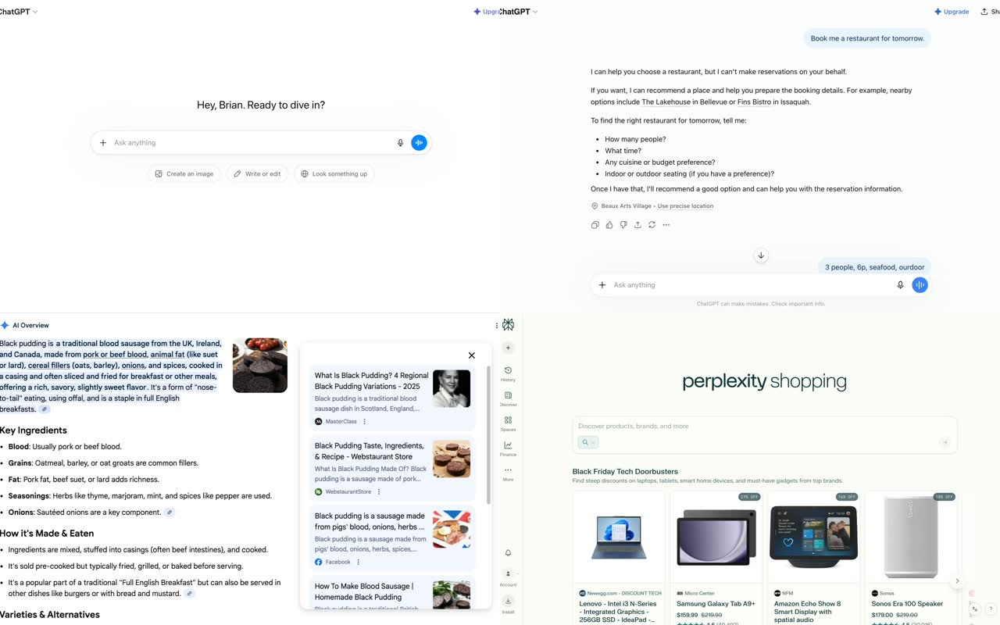

# Awesome AI UX Patterns

> A curated catalog of **183 AI UX / AI design patterns** — with definitions, when-to-use guidance, product examples, and **live interactive demos**.

**[Browse live demos on AI UX Playground →](https://aiuxplayground.com/patterns)**

  

If this helps your team ship better AI product UX, **star the repo** to bookmark it — and open a [pattern suggestion](https://github.com/slb2248/ai-ux-patterns/issues/new) when you spot something new.

## Why this exists

Most AI UI references are screenshots without structure. This catalog names the patterns, explains **when to use / when not to**, calls out **anti-patterns**, and links every entry to a **working demo** on [aiuxplayground.com](https://aiuxplayground.com).

Built for product designers, design engineers, and PMs shipping chat, agents, and AI-native surfaces.

## How to use

| You are… | Start here |
|----------|------------|
| Designing a chat / agent feature | Pick a category below → open **Details** → click **Demo** |
| Auditing an existing AI product | Search this README (`Cmd/Ctrl+F`) for the interaction → compare anti-patterns |
| Building a design system | Use [`catalog.json`](catalog.json) as a machine-readable checklist |
| Exploring inspiration | Jump to [Featured](#featured-patterns) then the [live hub](https://aiuxplayground.com/patterns) |

## Featured patterns

- **[Tool Switching in Composer](https://aiuxplayground.com/pattern/tool-switching)** — Switch between AI capabilities within composer · [Details](patterns/input/tool-switching.md)
- **[Human in the loop](https://aiuxplayground.com/pattern/human-in-the-loop)** — Require human approval before AI acts · [Details](patterns/collab/human-in-the-loop.md)
- **[Citations](https://aiuxplayground.com/pattern/citations)** — Attach verifiable sources to generated claims · [Details](patterns/trust/citations.md)
- **[Chat Artifacts](https://aiuxplayground.com/pattern/chat-artifact)** — Open generated docs and code in a side panel · [Details](patterns/chatbot/chat-artifact.md)
- **[Memory Management](https://aiuxplayground.com/pattern/memory-manage)** — Viewing what AI remembers · [Details](patterns/agents/memory-manage.md)
- **[Instant Buy](https://aiuxplayground.com/pattern/instant-buy)** — One-click purchase from AI · [Details](patterns/commerce/instant-buy.md)
- **[Generative UI](https://aiuxplayground.com/pattern/gen-ui)** — Render interactive UI components in the answer · [Details](patterns/output/gen-ui.md)
- **[Thread Branching](https://aiuxplayground.com/pattern/thread-branch)** — Edit and fork chats · [Details](patterns/chatbot/thread-branch.md)

## Categories

- [Chatbot](#chatbot) (12)
- [Inputs](#inputs) (22)
- [Outputs](#outputs) (17)
- [Agents](#agents) (30)
- [Trust](#trust) (26)
- [Collab](#collab) (5)
- [Design Tools](#design-tools) (13)
- [Audio](#audio) (11)
- [Commerce](#commerce) (16)
- [Onboarding](#onboarding) (9)
- [Navigation](#navigation) (10)
- [Performance](#performance) (12)

## Pattern index

### Chatbot

[Live demos →](https://aiuxplayground.com/patterns/chatbot) · [Folder](patterns/chatbot/)

- [Chat Artifacts](patterns/chatbot/chat-artifact.md) — Open generated docs and code in a side panel · [Demo](https://aiuxplayground.com/pattern/chat-artifact)
- [Conversation History Search](patterns/chatbot/conversation-search.md) — Search through past conversations · [Demo](https://aiuxplayground.com/pattern/conversation-search)
- [Conversation Tags & Labels](patterns/chatbot/conversation-tags.md) — Organize conversations with tags · [Demo](https://aiuxplayground.com/pattern/conversation-tags)
- [Conversation Templates](patterns/chatbot/conversation-templates.md) — Save and reuse conversation starters · [Demo](https://aiuxplayground.com/pattern/conversation-templates)
- [Export Conversation](patterns/chatbot/export-conversation.md) — Export chats as PDF/Markdown/JSON · [Demo](https://aiuxplayground.com/pattern/export-conversation)
- [Interrupt and Resume](patterns/chatbot/interrupt-and-resume.md) — Stop mid-response and continue with context · [Demo](https://aiuxplayground.com/pattern/interrupt-and-resume)
- [Memory Scope Toggle](patterns/chatbot/memory-scope-toggle.md) — Set memory persistence per message · [Demo](https://aiuxplayground.com/pattern/memory-scope-toggle)
- [Message Pinning](patterns/chatbot/message-pinning.md) — Pin important messages · [Demo](https://aiuxplayground.com/pattern/message-pinning)
- [Regeneration Carousel](patterns/chatbot/regen-carousel.md) — Swipe bot responses · [Demo](https://aiuxplayground.com/pattern/regen-carousel)
- [Repair Contract](patterns/chatbot/repair-contract.md) — Retry with explicit delta and constraints · [Demo](https://aiuxplayground.com/pattern/repair-contract)
- [Response Refinement](patterns/chatbot/response-refinement.md) — Modify AI responses with contextual actions · [Demo](https://aiuxplayground.com/pattern/response-refinement)
- [Thread Branching](patterns/chatbot/thread-branch.md) — Edit and fork chats · [Demo](https://aiuxplayground.com/pattern/thread-branch)

### Inputs

[Live demos →](https://aiuxplayground.com/patterns/input) · [Folder](patterns/input/)

- [AI Context Menu](patterns/input/context-menu.md) — Actions on select · [Demo](https://aiuxplayground.com/pattern/context-menu)
- [Batch Input Processing](patterns/input/batch-input-processing.md) — Process multiple inputs at once · [Demo](https://aiuxplayground.com/pattern/batch-input-processing)
- [Command Bar](patterns/input/command-bar.md) — Jump to AI actions with a command palette · [Demo](https://aiuxplayground.com/pattern/command-bar)
- [Context Chip Management](patterns/input/context-chip-management.md) — Adding context sources via menu with removable chips · [Demo](https://aiuxplayground.com/pattern/context-chip-management)
- [Context Mentions](patterns/input/mention.md) — Reference files via @ · [Demo](https://aiuxplayground.com/pattern/mention)
- [Dynamic Follow-ups](patterns/input/follow-up.md) — Suggested questions · [Demo](https://aiuxplayground.com/pattern/follow-up)
- [File Upload with AI Preview](patterns/input/file-upload-preview.md) — Upload files with AI-generated previews · [Demo](https://aiuxplayground.com/pattern/file-upload-preview)
- [Follow-up Chips](patterns/input/follow-up-chips.md) — Suggested next turns · [Demo](https://aiuxplayground.com/pattern/follow-up-chips)
- [Gesture Input](patterns/input/gesture-input.md) — Draw or gesture to trigger AI actions · [Demo](https://aiuxplayground.com/pattern/gesture-input)
- [Input Mode Toggle](patterns/input/input-mode-toggle.md) — Switch between text, voice, and dictation modes · [Demo](https://aiuxplayground.com/pattern/input-mode-toggle)
- [Magic Edit](patterns/input/magic-edit.md) — Transform selection · [Demo](https://aiuxplayground.com/pattern/magic-edit)
- [Multimodal Input](patterns/input/multimodal.md) — Combine images, files, and text in one turn · [Demo](https://aiuxplayground.com/pattern/multimodal)
- [Persona Selector](patterns/input/persona-selector.md) — Change AI role · [Demo](https://aiuxplayground.com/pattern/persona-selector)
- [Predictive Type](patterns/input/predictive-type.md) — Ghost text · [Demo](https://aiuxplayground.com/pattern/predictive-type)
- [Prompt Starters](patterns/input/empty-state.md) — Example prompts on an empty chat screen · [Demo](https://aiuxplayground.com/pattern/empty-state)
- [Prompt Templates](patterns/input/templates.md) — Starter prompts · [Demo](https://aiuxplayground.com/pattern/templates)
- [Slash Commands](patterns/input/slash-command.md) — Quick actions via / · [Demo](https://aiuxplayground.com/pattern/slash-command)
- [Smart Autocomplete](patterns/input/smart-autocomplete.md) — Context-aware autocomplete beyond text · [Demo](https://aiuxplayground.com/pattern/smart-autocomplete)
- [Tone Sliders](patterns/input/tone-slider.md) — Adjust style · [Demo](https://aiuxplayground.com/pattern/tone-slider)
- [Tool Switching in Composer](patterns/input/tool-switching.md) — Switch between AI capabilities within composer · [Demo](https://aiuxplayground.com/pattern/tool-switching)
- [Voice Input](patterns/input/voice-input.md) — Speech-to-text with visual feedback · [Demo](https://aiuxplayground.com/pattern/voice-input)
- [Voice-to-Action](patterns/input/voice-to-action.md) — Voice commands that trigger specific actions · [Demo](https://aiuxplayground.com/pattern/voice-to-action)

### Outputs

[Live demos →](https://aiuxplayground.com/patterns/output) · [Folder](patterns/output/)

- [Auto Tagging](patterns/output/auto-tag.md) — AI metadata · [Demo](https://aiuxplayground.com/pattern/auto-tag)
- [Conversation Summary](patterns/output/conversation-summary.md) — Auto-summarize long chats · [Demo](https://aiuxplayground.com/pattern/conversation-summary)
- [Feedback](patterns/output/feedback-loops.md) — Collect thumbs and comments to improve answers · [Demo](https://aiuxplayground.com/pattern/feedback-loops)
- [Generative Charts](patterns/output/gen-chart.md) — Text to viz · [Demo](https://aiuxplayground.com/pattern/gen-chart)
- [Generative UI](patterns/output/gen-ui.md) — Render interactive UI components in the answer · [Demo](https://aiuxplayground.com/pattern/gen-ui)
- [Instant Translation](patterns/output/lang-toggle.md) — Swap language · [Demo](https://aiuxplayground.com/pattern/lang-toggle)
- [Message Reactions](patterns/output/message-reactions.md) — Quick emoji reactions · [Demo](https://aiuxplayground.com/pattern/message-reactions)
- [Output Analytics](patterns/output/output-analytics.md) — Track which outputs users prefer/use most · [Demo](https://aiuxplayground.com/pattern/output-analytics)
- [Output Comparison View](patterns/output/output-comparison-view.md) — Side-by-side comparison of multiple outputs · [Demo](https://aiuxplayground.com/pattern/output-comparison-view)
- [Output Format Selection](patterns/output/output-format-selection.md) — Choose output format (JSON, CSV, Markdown) · [Demo](https://aiuxplayground.com/pattern/output-format-selection)
- [Output History](patterns/output/output-history.md) — Browse and restore previous outputs · [Demo](https://aiuxplayground.com/pattern/output-history)
- [Output Sharing](patterns/output/output-sharing.md) — Share outputs with permissions/links · [Demo](https://aiuxplayground.com/pattern/output-sharing)
- [Progressive Disclosure](patterns/output/progressive-disclosure.md) — Gradually reveal complex information · [Demo](https://aiuxplayground.com/pattern/progressive-disclosure)
- [Scroll to Bottom](patterns/output/scroll-bottom.md) — New message alert · [Demo](https://aiuxplayground.com/pattern/scroll-bottom)
- [Skeleton Screens](patterns/output/skeleton-loader.md) — Show content shape while loading · [Demo](https://aiuxplayground.com/pattern/skeleton-loader)
- [Smart Code Blocks](patterns/output/smart-code.md) — Interactive snippets · [Demo](https://aiuxplayground.com/pattern/smart-code)
- [Streaming](patterns/output/streaming.md) — Show replies token-by-token as they generate · [Demo](https://aiuxplayground.com/pattern/streaming)

### Agents

[Live demos →](https://aiuxplayground.com/patterns/agents) · [Folder](patterns/agents/)

- [Agent Marketplace](patterns/agents/agent-marketplace.md) — Browse and install pre-built agents · [Demo](https://aiuxplayground.com/pattern/agent-marketplace)
- [Agent Orchestration](patterns/agents/agent-orchestration.md) — Visual flow for multiple agents · [Demo](https://aiuxplayground.com/pattern/agent-orchestration)
- [Agent Performance Metrics](patterns/agents/agent-performance-metrics.md) — Dashboard showing agent success rates · [Demo](https://aiuxplayground.com/pattern/agent-performance-metrics)
- [Agent Versioning](patterns/agents/agent-versioning.md) — A/B test different agent configurations · [Demo](https://aiuxplayground.com/pattern/agent-versioning)
- [Ambient Presence Displays](patterns/agents/ambient-presence-displays.md) — Low-attention signals for agent state · [Demo](https://aiuxplayground.com/pattern/ambient-presence-displays)
- [Approval Workflows](patterns/agents/approval-workflows.md) — Human approval gates · [Demo](https://aiuxplayground.com/pattern/approval-workflows)
- [Autonomous Mode Display](patterns/agents/autonomous-mode-display.md) — Persistent signal when agent runs unattended · [Demo](https://aiuxplayground.com/pattern/autonomous-mode-display)
- [Autonomy Budgets](patterns/agents/autonomy-budgets.md) — Time- or action-bounded unattended runs · [Demo](https://aiuxplayground.com/pattern/autonomy-budgets)
- [Blast Radius Visualization](patterns/agents/blast-radius-visualization.md) — Preview scope before agent executes · [Demo](https://aiuxplayground.com/pattern/blast-radius-visualization)
- [Checkpoints and Restore](patterns/agents/checkpoints-and-restore.md) — Named snapshots with one-click restore · [Demo](https://aiuxplayground.com/pattern/checkpoints-and-restore)
- [Conditional Logic & Branching](patterns/agents/conditional-logic.md) — Branch workflows by conditions · [Demo](https://aiuxplayground.com/pattern/conditional-logic)
- [Context Portability](patterns/agents/context-portability.md) — Legible payloads across app boundaries · [Demo](https://aiuxplayground.com/pattern/context-portability)
- [Error Recovery Strategies](patterns/agents/error-recovery-strategies.md) — Configurable retry/fallback patterns · [Demo](https://aiuxplayground.com/pattern/error-recovery-strategies)
- [Escalation Thresholds](patterns/agents/escalation-thresholds.md) — Auto-demote autonomy when risk crosses a line · [Demo](https://aiuxplayground.com/pattern/escalation-thresholds)
- [Human Handoff](patterns/agents/human-handoff.md) — Escalating to humans · [Demo](https://aiuxplayground.com/pattern/human-handoff)
- [Memory Management](patterns/agents/memory-manage.md) — Viewing what AI remembers · [Demo](https://aiuxplayground.com/pattern/memory-manage)
- [Multi-step Forms with AI](patterns/agents/multi-step-forms.md) — Adaptive progressive forms · [Demo](https://aiuxplayground.com/pattern/multi-step-forms)
- [Per-Action Autonomy](patterns/agents/per-action-autonomy.md) — Autonomy scoped per capability, not per app · [Demo](https://aiuxplayground.com/pattern/per-action-autonomy)
- [Plan & Execute](patterns/agents/plan-execute.md) — Breaking goals into steps · [Demo](https://aiuxplayground.com/pattern/plan-execute)
- [Pre-Task Cost Estimate](patterns/agents/pre-task-cost-estimate.md) — Forecast tokens, dollars, and time before run · [Demo](https://aiuxplayground.com/pattern/pre-task-cost-estimate)
- [Prompt Chaining](patterns/agents/chain.md) — Multi-step logic · [Demo](https://aiuxplayground.com/pattern/chain)
- [Reversibility Marking](patterns/agents/reversibility-marking.md) — Label actions by how easily undone · [Demo](https://aiuxplayground.com/pattern/reversibility-marking)
- [Sandbox Preview](patterns/agents/sandbox-preview.md) — Dry-run plan with explicit side effects before execute · [Demo](https://aiuxplayground.com/pattern/sandbox-preview)
- [Scheduled Tasks & Recurring Actions](patterns/agents/scheduled-tasks.md) — Time-based automation triggers · [Demo](https://aiuxplayground.com/pattern/scheduled-tasks)
- [Self-Correction](patterns/agents/correction.md) — Agents fixing errors · [Demo](https://aiuxplayground.com/pattern/correction)
- [Suggest / Confirm / Execute](patterns/agents/suggest-confirm-execute.md) — Three autonomy modes for AI agents · [Demo](https://aiuxplayground.com/pattern/suggest-confirm-execute)
- [Task Queue](patterns/agents/task-queue.md) — Visual queue of agent tasks · [Demo](https://aiuxplayground.com/pattern/task-queue)
- [Time-Delayed Execution](patterns/agents/time-delayed-execution.md) — Cancelable countdown before high-impact actions · [Demo](https://aiuxplayground.com/pattern/time-delayed-execution)
- [Tool Use](patterns/agents/tool-use.md) — Visualizing AI using external tools · [Demo](https://aiuxplayground.com/pattern/tool-use)
- [Workflow Builder](patterns/agents/workflow-builder.md) — Visual drag-and-drop workflows · [Demo](https://aiuxplayground.com/pattern/workflow-builder)

### Trust

[Live demos →](https://aiuxplayground.com/patterns/trust) · [Folder](patterns/trust/)

- [Agent Identity](patterns/trust/agent-identity.md) — Stable name, version, and capabilities per agent · [Demo](https://aiuxplayground.com/pattern/agent-identity)
- [Audit Trail](patterns/trust/audit-trail.md) — Complete log of AI decisions and data usage · [Demo](https://aiuxplayground.com/pattern/audit-trail)
- [Authentication Chains](patterns/trust/authentication-chains.md) — Legible identity trails across agent actions · [Demo](https://aiuxplayground.com/pattern/authentication-chains)
- [Bias Detection](patterns/trust/bias-detection.md) — Flag potentially biased outputs · [Demo](https://aiuxplayground.com/pattern/bias-detection)
- [Chain of Thought](patterns/trust/cot.md) — Reveal step-by-step reasoning behind an answer · [Demo](https://aiuxplayground.com/pattern/cot)
- [Citation Tooltips](patterns/trust/citation-hover.md) — Hover for source · [Demo](https://aiuxplayground.com/pattern/citation-hover)
- [Citations](patterns/trust/citations.md) — Attach verifiable sources to generated claims · [Demo](https://aiuxplayground.com/pattern/citations)
- [Confidence Indicators](patterns/trust/confidence-indicators.md) — Visual confidence levels for outputs · [Demo](https://aiuxplayground.com/pattern/confidence-indicators)
- [Confidence Score](patterns/trust/confidence-score.md) — Show how sure the model is about a claim · [Demo](https://aiuxplayground.com/pattern/confidence-score)
- [Data Ownership & Control](patterns/trust/data-ownership.md) — User control over AI data usage · [Demo](https://aiuxplayground.com/pattern/data-ownership)
- [Duration-Bound Consent](patterns/trust/duration-bound-consent.md) — Permissions that expire by default · [Demo](https://aiuxplayground.com/pattern/duration-bound-consent)
- [Fact-Checking Indicators](patterns/trust/fact-checking-indicators.md) — Real-time fact-checking status · [Demo](https://aiuxplayground.com/pattern/fact-checking-indicators)
- [Failure Disclosure](patterns/trust/failure-disclosure.md) — Honest signaling of AI limitations · [Demo](https://aiuxplayground.com/pattern/failure-disclosure)
- [Granular Consent](patterns/trust/granular-consent.md) — Per-capability toggles, not bundled grants · [Demo](https://aiuxplayground.com/pattern/granular-consent)
- [Knowledge Graph](patterns/trust/knowledge-graph.md) — Visualizing RAG · [Demo](https://aiuxplayground.com/pattern/knowledge-graph)
- [Permission Drift Indicator](patterns/trust/permission-drift-indicator.md) — Surface accumulated agent permissions · [Demo](https://aiuxplayground.com/pattern/permission-drift-indicator)
- [Privacy Filters](patterns/trust/privacy-blur.md) — Masking PII · [Demo](https://aiuxplayground.com/pattern/privacy-blur)
- [Progress Steps](patterns/trust/status-steps.md) — Collapsible thinking and tool traces · [Demo](https://aiuxplayground.com/pattern/status-steps)
- [Responsibility Attribution](patterns/trust/responsibility-attribution.md) — Trace which agent or human caused each action · [Demo](https://aiuxplayground.com/pattern/responsibility-attribution)
- [Retrieval Context Preview](patterns/trust/retrieval-context-preview.md) — Preview retrieved context before acting on the answer · [Demo](https://aiuxplayground.com/pattern/retrieval-context-preview)
- [Revocation Affordances](patterns/trust/revocation-affordances.md) — One-click revoke beside the grant · [Demo](https://aiuxplayground.com/pattern/revocation-affordances)
- [Scope Disclosure](patterns/trust/scope-disclosure.md) — Plain-language agent permissions · [Demo](https://aiuxplayground.com/pattern/scope-disclosure)
- [Source Browser](patterns/trust/source-browser.md) — Inspect source documents beside the answer · [Demo](https://aiuxplayground.com/pattern/source-browser)
- [Source Quality Scores](patterns/trust/source-quality-scores.md) — Rate source reliability · [Demo](https://aiuxplayground.com/pattern/source-quality-scores)
- [Transparency Report](patterns/trust/transparency-report.md) — Periodic reports on AI behavior/accuracy · [Demo](https://aiuxplayground.com/pattern/transparency-report)
- [Verification Next Steps](patterns/trust/verification-next-steps.md) — Concrete actions to validate uncertain output · [Demo](https://aiuxplayground.com/pattern/verification-next-steps)

### Collab

[Live demos →](https://aiuxplayground.com/patterns/collab) · [Folder](patterns/collab/)

- [Human in the loop](patterns/collab/human-in-the-loop.md) — Require human approval before AI acts · [Demo](https://aiuxplayground.com/pattern/human-in-the-loop)
- [Inline Comment Thread](patterns/collab/inline-comment-thread.md) — Discuss selections · [Demo](https://aiuxplayground.com/pattern/inline-comment-thread)
- [Live Presence](patterns/collab/live-presence.md) — Who is here now · [Demo](https://aiuxplayground.com/pattern/live-presence)
- [Shared Session Link](patterns/collab/shared-session-link.md) — Shareable AI context · [Demo](https://aiuxplayground.com/pattern/shared-session-link)
- [Smart Diff](patterns/collab/smart-diff.md) — Highlight and review what the model changed · [Demo](https://aiuxplayground.com/pattern/smart-diff)

### Design Tools

[Live demos →](https://aiuxplayground.com/patterns/design) · [Folder](patterns/design/)

- [Background Removal](patterns/design/background-removal.md) — Automatic background removal/transparency · [Demo](https://aiuxplayground.com/pattern/background-removal)
- [Color Palette Generator](patterns/design/color-palette-gen.md) — Generate color schemes from images/text · [Demo](https://aiuxplayground.com/pattern/color-palette-gen)
- [Component Variants](patterns/design/component-variants.md) — Generate multiple UI variations · [Demo](https://aiuxplayground.com/pattern/component-variants)
- [Image Upscaling](patterns/design/image-upscaling.md) — AI-powered resolution enhancement · [Demo](https://aiuxplayground.com/pattern/image-upscaling)
- [In-painting](patterns/design/inpainting.md) — Modify specific areas · [Demo](https://aiuxplayground.com/pattern/inpainting)
- [Infinite Canvas](patterns/design/infinite-canvas.md) — Spatial AI organization · [Demo](https://aiuxplayground.com/pattern/infinite-canvas)
- [Object Removal](patterns/design/object-removal.md) — Remove unwanted objects from images · [Demo](https://aiuxplayground.com/pattern/object-removal)
- [Prompt to UI](patterns/design/prompt-ui.md) — Generate editable UI from a text prompt · [Demo](https://aiuxplayground.com/pattern/prompt-ui)
- [Style Interpolation](patterns/design/style-interpolation.md) — Blend between multiple styles · [Demo](https://aiuxplayground.com/pattern/style-interpolation)
- [Style Transfer](patterns/design/style-transfer.md) — Applying visual styles · [Demo](https://aiuxplayground.com/pattern/style-transfer)
- [Text-to-Image with Advanced Controls](patterns/design/text-to-image-controls.md) — Advanced generation controls · [Demo](https://aiuxplayground.com/pattern/text-to-image-controls)
- [Theme Generation](patterns/design/theme-gen.md) — Color system creation · [Demo](https://aiuxplayground.com/pattern/theme-gen)
- [Variation Picker](patterns/design/variation-grid.md) — Pick among side-by-side generated options · [Demo](https://aiuxplayground.com/pattern/variation-grid)

### Audio

[Live demos →](https://aiuxplayground.com/patterns/audio) · [Folder](patterns/audio/)

- [Activation Boundaries](patterns/audio/activation-boundaries.md) — Explicit starts and stops for always-on agents · [Demo](https://aiuxplayground.com/pattern/activation-boundaries)
- [Audio Enhancement](patterns/audio/audio-enhancement.md) — Noise reduction, clarity improvement · [Demo](https://aiuxplayground.com/pattern/audio-enhancement)
- [Audio Summarization](patterns/audio/audio-summarization.md) — Summarize long audio recordings · [Demo](https://aiuxplayground.com/pattern/audio-summarization)
- [Interruptibility](patterns/audio/interruptibility.md) — Single gesture to pause or cancel · [Demo](https://aiuxplayground.com/pattern/interruptibility)
- [Live Transcript](patterns/audio/live-transcript.md) — Real-time text from audio · [Demo](https://aiuxplayground.com/pattern/live-transcript)
- [Multi-User Awareness](patterns/audio/multi-user-awareness.md) — Identify speaker and scope to their permissions · [Demo](https://aiuxplayground.com/pattern/multi-user-awareness)
- [Real-time Translation](patterns/audio/real-time-translation.md) — Live translation during voice conversations · [Demo](https://aiuxplayground.com/pattern/real-time-translation)
- [Voice Cloning](patterns/audio/voice-cloning.md) — Clone and use custom voices · [Demo](https://aiuxplayground.com/pattern/voice-cloning)
- [Voice Commands](patterns/audio/voice-commands.md) — Trigger actions via voice commands · [Demo](https://aiuxplayground.com/pattern/voice-commands)
- [Voice Confirmation](patterns/audio/voice-confirmation.md) — Spoken approval for high-stakes voice actions · [Demo](https://aiuxplayground.com/pattern/voice-confirmation)
- [Voice Visualizer](patterns/audio/voice-visualizer.md) — Feedback for voice mode · [Demo](https://aiuxplayground.com/pattern/voice-visualizer)

### Commerce

[Live demos →](https://aiuxplayground.com/patterns/commerce) · [Folder](patterns/commerce/)

- [AI-Powered Customer Support](patterns/commerce/ai-customer-support.md) — Proactive support suggestions · [Demo](https://aiuxplayground.com/pattern/ai-customer-support)
- [Dynamic Pricing](patterns/commerce/dynamic-pricing.md) — AI-powered real-time price optimization · [Demo](https://aiuxplayground.com/pattern/dynamic-pricing)
- [Fraud Alert](patterns/commerce/fraud-detection.md) — Verify suspicious acts · [Demo](https://aiuxplayground.com/pattern/fraud-detection)
- [Instant Buy](patterns/commerce/instant-buy.md) — One-click purchase from AI · [Demo](https://aiuxplayground.com/pattern/instant-buy)
- [Inventory Prediction](patterns/commerce/inventory-prediction.md) — Predict stock needs based on trends · [Demo](https://aiuxplayground.com/pattern/inventory-prediction)
- [Natural Language Filter](patterns/commerce/nl-filter.md) — Turn natural language into editable filters · [Demo](https://aiuxplayground.com/pattern/nl-filter)
- [Personalized Checkout](patterns/commerce/personalized-checkout.md) — Custom checkout flow per user · [Demo](https://aiuxplayground.com/pattern/personalized-checkout)
- [Price Drop Alerts](patterns/commerce/price-drop-alerts.md) — Notify users of price changes · [Demo](https://aiuxplayground.com/pattern/price-drop-alerts)
- [Return Prediction](patterns/commerce/return-prediction.md) — Predict likelihood of returns · [Demo](https://aiuxplayground.com/pattern/return-prediction)
- [Review Summary](patterns/commerce/review-summary.md) — Summarizing feedback · [Demo](https://aiuxplayground.com/pattern/review-summary)
- [Semantic Search](patterns/commerce/semantic-search.md) — Retrieve items by meaning, not keywords · [Demo](https://aiuxplayground.com/pattern/semantic-search)
- [Smart Bundles](patterns/commerce/smart-bundles.md) — Contextual upsell · [Demo](https://aiuxplayground.com/pattern/smart-bundles)
- [Smart Comparison](patterns/commerce/comparison.md) — Build dynamic product or option comparison tables · [Demo](https://aiuxplayground.com/pattern/comparison)
- [Smart Form Fill](patterns/commerce/smart-fill.md) — Unstructured to structured · [Demo](https://aiuxplayground.com/pattern/smart-fill)
- [Smart Recommendations](patterns/commerce/smart-recommendations.md) — Context-aware product suggestions · [Demo](https://aiuxplayground.com/pattern/smart-recommendations)
- [Visual Search](patterns/commerce/visual-search.md) — Find products or images from an uploaded photo · [Demo](https://aiuxplayground.com/pattern/visual-search)

### Onboarding

[Live demos →](https://aiuxplayground.com/patterns/onboarding) · [Folder](patterns/onboarding/)

- [AI Personality Customization](patterns/onboarding/ai-personality-customization.md) — Customize AI assistant personality · [Demo](https://aiuxplayground.com/pattern/ai-personality-customization)
- [AI Tips & Tricks](patterns/onboarding/ai-tips-tricks.md) — Contextual AI guidance · [Demo](https://aiuxplayground.com/pattern/ai-tips-tricks)
- [Example Prompts Library](patterns/onboarding/example-prompts-library.md) — Curated prompt examples · [Demo](https://aiuxplayground.com/pattern/example-prompts-library)
- [First Success Flow](patterns/onboarding/first-success-flow.md) — Guaranteed first successful AI interaction · [Demo](https://aiuxplayground.com/pattern/first-success-flow)
- [Interactive Tutorials](patterns/onboarding/interactive-tutorials.md) — Step-by-step AI guides · [Demo](https://aiuxplayground.com/pattern/interactive-tutorials)
- [Learning Path Recommendations](patterns/onboarding/learning-path-recommendations.md) — Personalized learning paths · [Demo](https://aiuxplayground.com/pattern/learning-path-recommendations)
- [Onboarding Progress Tracking](patterns/onboarding/onboarding-progress-tracking.md) — Visual progress through onboarding · [Demo](https://aiuxplayground.com/pattern/onboarding-progress-tracking)
- [Progressive Feature Unlock](patterns/onboarding/progressive-feature-unlock.md) — Gradual AI introduction · [Demo](https://aiuxplayground.com/pattern/progressive-feature-unlock)
- [Use Case Wizard](patterns/onboarding/use-case-wizard.md) — Guided setup based on user goals · [Demo](https://aiuxplayground.com/pattern/use-case-wizard)

### Navigation

[Live demos →](https://aiuxplayground.com/patterns/navigation) · [Folder](patterns/navigation/)

- [AI Capability Explorer](patterns/navigation/ai-capability-explorer.md) — Interactive feature guide · [Demo](https://aiuxplayground.com/pattern/ai-capability-explorer)
- [AI Command History](patterns/navigation/ai-command-history.md) — Recent AI commands with quick replay · [Demo](https://aiuxplayground.com/pattern/ai-command-history)
- [AI Feature Spotlight](patterns/navigation/ai-feature-spotlight.md) — Highlight AI capabilities · [Demo](https://aiuxplayground.com/pattern/ai-feature-spotlight)
- [AI-Powered Search](patterns/navigation/ai-powered-search.md) — Semantic search across all features · [Demo](https://aiuxplayground.com/pattern/ai-powered-search)
- [Contextual AI Suggestions](patterns/navigation/contextual-ai-suggestions.md) — Task-based AI prompts · [Demo](https://aiuxplayground.com/pattern/contextual-ai-suggestions)
- [Contextual Shortcuts](patterns/navigation/contextual-shortcuts.md) — Shortcuts that adapt to current task · [Demo](https://aiuxplayground.com/pattern/contextual-shortcuts)
- [Feature Discovery Feed](patterns/navigation/feature-discovery-feed.md) — Personalized feed of AI features to try · [Demo](https://aiuxplayground.com/pattern/feature-discovery-feed)
- [Proactive Nudge](patterns/navigation/nudge.md) — Helpful hints · [Demo](https://aiuxplayground.com/pattern/nudge)
- [Smart Bookmarks](patterns/navigation/smart-bookmarks.md) — AI-suggested bookmarks based on usage · [Demo](https://aiuxplayground.com/pattern/smart-bookmarks)
- [Smart Tooltips](patterns/navigation/smart-tooltips.md) — Progressive AI hints · [Demo](https://aiuxplayground.com/pattern/smart-tooltips)

### Performance

[Live demos →](https://aiuxplayground.com/patterns/performance) · [Folder](patterns/performance/)

- [Batch Processing Queue](patterns/performance/batch-processing-queue.md) — Queue multiple requests for efficiency · [Demo](https://aiuxplayground.com/pattern/batch-processing-queue)
- [Caching Indicators](patterns/performance/caching-indicators.md) — Show when cached results are used · [Demo](https://aiuxplayground.com/pattern/caching-indicators)
- [Cost Transparency](patterns/performance/cost-transparency.md) — Show operation costs · [Demo](https://aiuxplayground.com/pattern/cost-transparency)
- [Cross-Session Budget](patterns/performance/cross-session-budget.md) — Spending caps that persist across chats and devices · [Demo](https://aiuxplayground.com/pattern/cross-session-budget)
- [Hard Budget Ceilings](patterns/performance/hard-budget-ceilings.md) — Enforceable caps that stop the agent · [Demo](https://aiuxplayground.com/pattern/hard-budget-ceilings)
- [Model Selection UI](patterns/performance/model-selection-ui.md) — Let users choose AI model (speed vs quality) · [Demo](https://aiuxplayground.com/pattern/model-selection-ui)
- [Performance Optimization Tips](patterns/performance/performance-optimization-tips.md) — AI suggests ways to improve performance · [Demo](https://aiuxplayground.com/pattern/performance-optimization-tips)
- [Processing Time Estimates](patterns/performance/processing-time-estimates.md) — Expected wait times · [Demo](https://aiuxplayground.com/pattern/processing-time-estimates)
- [Rate Limit Warnings](patterns/performance/rate-limit-warnings.md) — API limit alerts · [Demo](https://aiuxplayground.com/pattern/rate-limit-warnings)
- [Resource Usage Dashboard](patterns/performance/resource-usage-dashboard.md) — Visual dashboard of compute/memory usage · [Demo](https://aiuxplayground.com/pattern/resource-usage-dashboard)
- [Running Meters](patterns/performance/running-meters.md) — Live token and cost counters during execution · [Demo](https://aiuxplayground.com/pattern/running-meters)
- [Token Usage Indicator](patterns/performance/token-usage-indicator.md) — API quota display · [Demo](https://aiuxplayground.com/pattern/token-usage-indicator)

## Suggest a pattern

See [CONTRIBUTING.md](CONTRIBUTING.md). New patterns land on the site first (with demos), then sync here.

## Links

- **Live demos:** [https://aiuxplayground.com/patterns](https://aiuxplayground.com/patterns)
- **Machine-readable index:** [catalog.json](catalog.json)
- **Twitter/X:** [@aiuxplayground](https://x.com/aiuxplayground)
- **LinkedIn:** [AI UX Playground](https://www.linkedin.com/company/aiuxplayground/)
- **Newsletter:** [Substack](https://aiuxplayground.substack.com)

## License

MIT — see [LICENSE](LICENSE). Attribution back to [AI UX Playground](https://aiuxplayground.com) is appreciated when you reuse entries.
