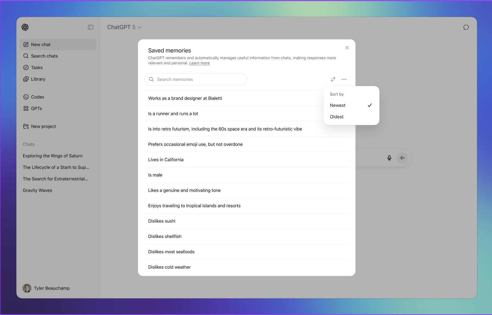
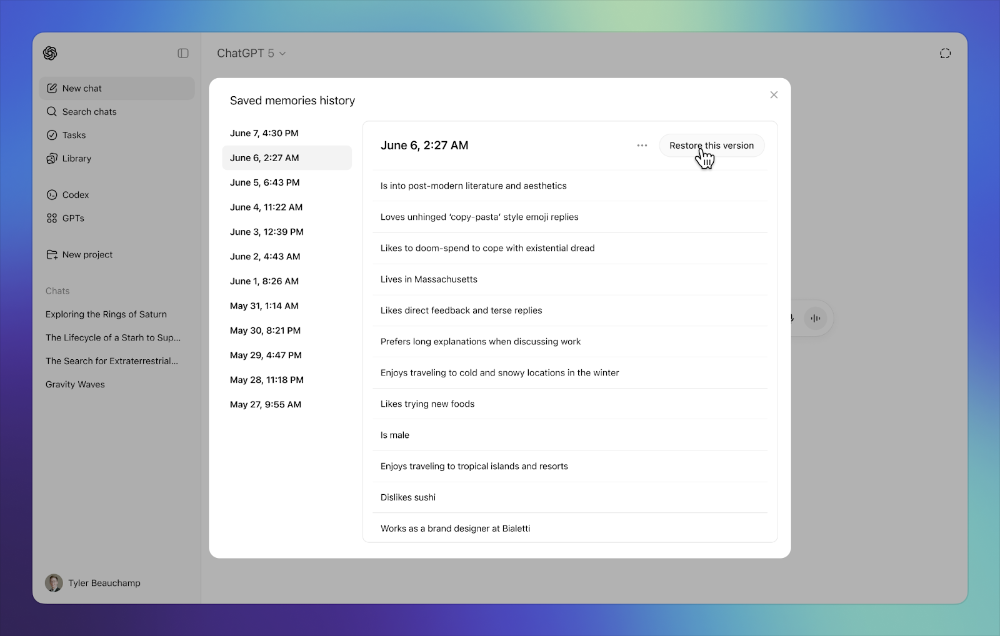

# Memory Management

**Category:** [Agents](https://aiuxplayground.com/patterns/agents)  
**Demo:** [aiuxplayground.com/pattern/memory-manage](https://aiuxplayground.com/pattern/memory-manage)

> Viewing what AI remembers

## Overview

Memory management is an AI UX pattern that lets users see, edit, prioritize, and delete what the assistant remembers across sessions. It turns inferred continuity into an inspectable list with clear off-ramps, so personalization does not feel like surveillance.

## Good for

Perfect for personal AI assistants, long-term agent relationships, and applications where the AI needs to remember user context across sessions.

## Skip it when

- Stateless tools where remembering prior chats adds risk without value.
- Regulated contexts that forbid durable personal memory without enterprise controls.
- Products that only need short thread context, not cross-session profile memory.

## Easy to get wrong

- Invisible memory that changes answers with no settings entry.
- No way to delete or export individual memories.
- Mixing declared preferences with inferred facts in one unlabeled blob.
- Turning memory off without explaining pause vs wipe.

## In the wild

| Product | Implementation |
|---------|----------------|
| ChatGPT | Saved memories list with search, prioritize/delete, and version restore. |
| Claude | Opt-in memory under Capabilities with import and pause-vs-reset. |
| Perplexity | Search-history memory toggle with Max-tier Brain upsell. |
| Gemini | Activity and personalization controls tied to Google account settings. |

## Screenshots

## On the site

[Memory Management demo](https://aiuxplayground.com/pattern/memory-manage) · [more agents](https://aiuxplayground.com/patterns/agents)
