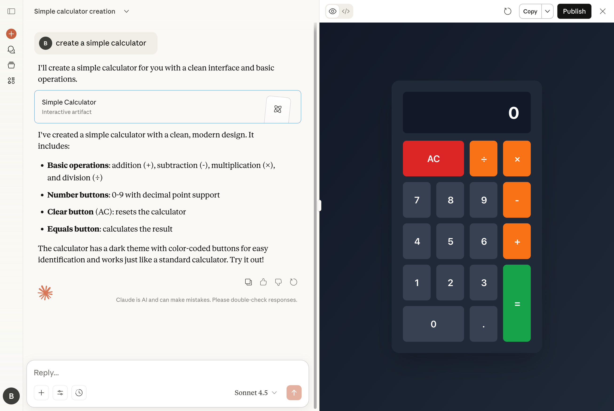
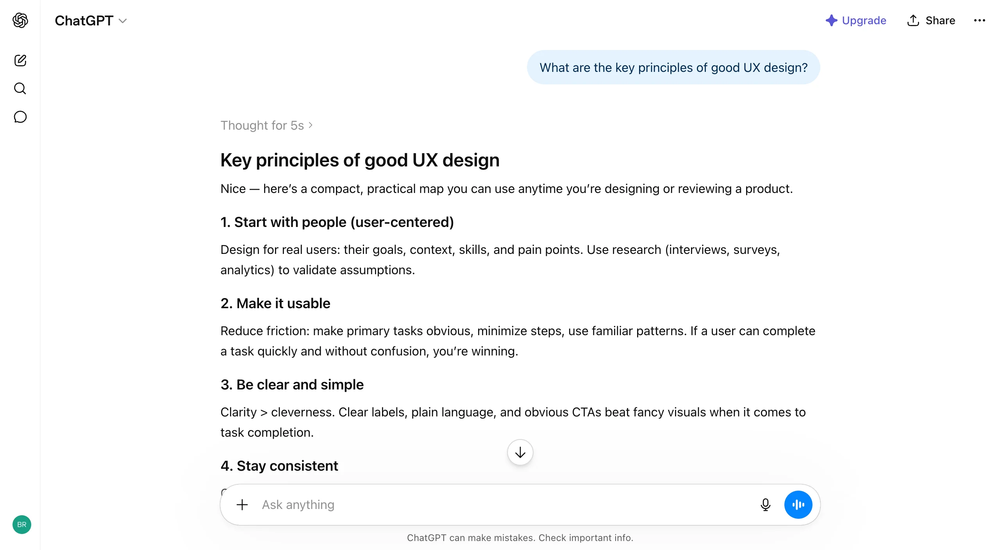

# Chat Artifacts

**Category:** [Chatbot](https://aiuxplayground.com/patterns/chatbot)  
**Demo:** [aiuxplayground.com/pattern/chat-artifact](https://aiuxplayground.com/pattern/chat-artifact)

> Open generated docs and code in a side panel

## Overview

Chat artifacts is an AI UX pattern that renders generated content, code, documents, diagrams, or structured data, in a dedicated side panel instead of inline in the conversation. This keeps the chat thread readable while giving users a persistent, interactive workspace to view, edit, and iterate on the output without losing the conversation context.

## Good for

Perfect for AI coding assistants, document generation tools, and design applications where generated content needs dedicated space for viewing and editing.

## Skip it when

- Short, disposable outputs like a one-line answer or single suggestion that do not warrant their own panel.
- Mobile layouts too narrow to show conversation and artifact side by side without heavy tab-switching.
- Outputs that are purely conversational text with nothing to interact with beyond reading.

## Easy to get wrong

- Artifacts that fork from the conversation with no visible link back to the message that created them.
- Overwriting an artifact on every regeneration with no version history to compare or revert.
- No export or copy path, trapping useful output inside the panel.
- Panels that cannot resize or collapse, permanently eating screen space on smaller viewports.

## In the wild

| Product | Implementation |
|---------|----------------|
| Claude Artifacts | Code, documents, and interactive components render in a side panel with version history. |
| Cursor | Generated code changes surface as diffs and files outside the chat thread itself. |
| Replit Agent | Generated apps run live in a preview pane alongside the agent conversation. |
| Notion AI | Generated content is written directly into the document rather than staying in a chat bubble. |

## Screenshots

## On the site

[Chat Artifacts demo](https://aiuxplayground.com/pattern/chat-artifact) · [more chatbot](https://aiuxplayground.com/patterns/chatbot)
