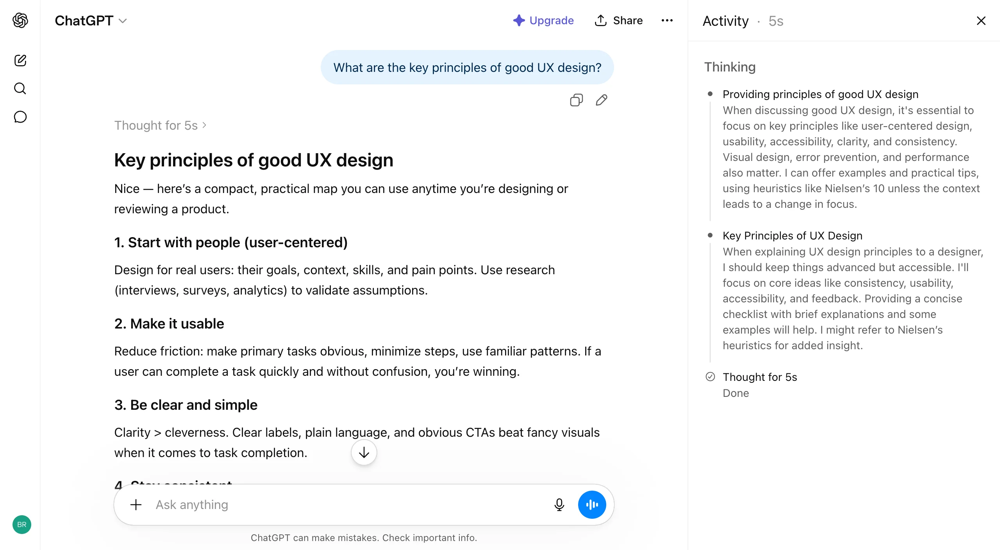

# Thread Branching

**Category:** [Chatbot](https://aiuxplayground.com/patterns/chatbot)  
**Demo:** [aiuxplayground.com/pattern/thread-branch](https://aiuxplayground.com/pattern/thread-branch)

> Edit and fork chats

## Overview

Thread branching is an AI interface design pattern that allows users to edit previous messages and create new conversation branches. This UX pattern enables users to explore different AI response paths without losing their original conversation context. When implemented in AI chatbots, it provides a non-destructive way to experiment with prompts and compare multiple AI-generated outcomes. This pattern is essential for complex workflows where users need to iterate on AI interactions, making it particularly valuable for coding assistance, creative exploration, and problem-solving scenarios.

## Good for

Ideal for AI coding assistants, creative writing tools, and research applications where users need to explore multiple solution paths without losing conversation history.

## Seen in

- ChatGPT
- Claude
- GitHub Copilot Chat
- Cursor

## Screenshots

## On the site

[Thread Branching demo](https://aiuxplayground.com/pattern/thread-branch) · [more chatbot](https://aiuxplayground.com/patterns/chatbot)
