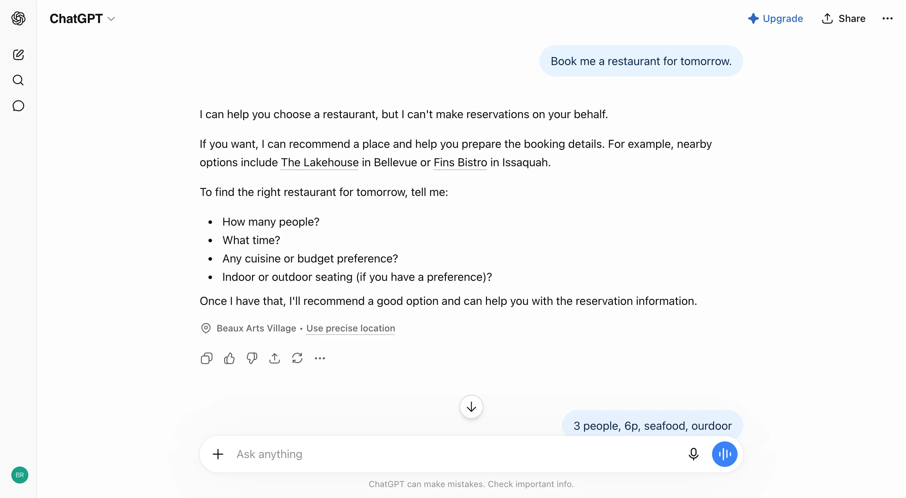
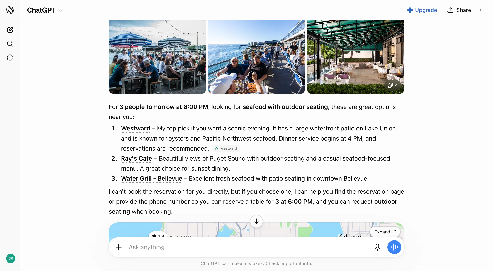

# Human in the loop

**Category:** [Collab](https://aiuxplayground.com/patterns/collab)  
**Interactive demo:** [https://aiuxplayground.com/pattern/human-in-the-loop](https://aiuxplayground.com/pattern/human-in-the-loop)

> Require human approval before AI acts

## What it is

Human in the loop is an AI UX pattern that requires human review or approval before the model executes a consequential action. The AI drafts, proposes, or stages work; a person confirms, edits, or rejects before send, purchase, deploy, or other irreversible effects. Use it when errors are costly and trust depends on visible control.

## When to use

Essential for email clients, code generation tools, and applications where human oversight of AI actions prevents errors and builds trust.

## When not to use

- Low-stakes, easily reversible suggestions where approval friction slows the user more than it protects them.
- Fully autonomous monitoring or batch jobs where the product already has hard budgets, rollback, and clear failure alerts.
- Every micro-edit in a creative canvas; prefer selective gates on publish, send, or spend instead.

## Anti-patterns

- Silent auto-send or auto-apply with only a buried undo.
- Approval UI that does not show the exact payload (email body, diff, amount) being approved.
- One global “always allow” that never re-prompts for higher-risk actions.
- Approval after the side effect already happened.

## How products use it

| Product | Implementation |
|---------|----------------|
| GitHub Copilot | Suggests code in-editor; human accepts, rejects, or edits before commit. |
| Gmail Smart Compose | Inline completions stay draft until the user sends the message. |
| ChatGPT | Agent and connector flows ask before sending email or taking external actions. |
| Gemini | Approval cards and send gates for actions that leave the chat surface. |

## Examples

*Human in the Loop*

*Human in the Loop*

## Try it live

Interactive demo, screenshots, and full guidance on the site:

**[Open Human in the loop on AI UX Playground →](https://aiuxplayground.com/pattern/human-in-the-loop)**

Or browse all [Collab patterns](https://aiuxplayground.com/patterns/collab).
