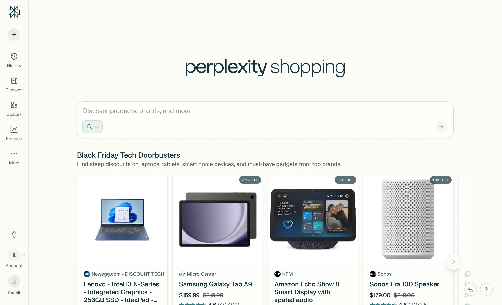
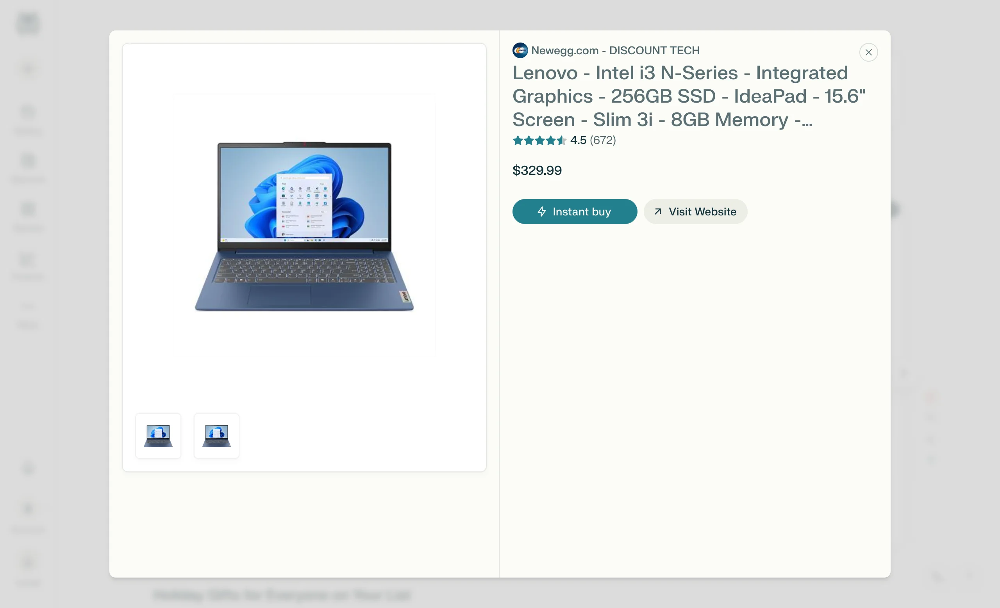

# Instant Buy

**Category:** [Commerce](https://aiuxplayground.com/patterns/commerce)  
**Demo:** [aiuxplayground.com/pattern/instant-buy](https://aiuxplayground.com/pattern/instant-buy)

> One-click purchase from AI

## Overview

Instant buy is an AI UX pattern that completes a purchase inside the AI surface (product, price, payment, and confirmation) without bouncing to a separate storefront. It shortens discovery-to-checkout for shopping assistants while keeping totals and consent explicit.

## Good for

Perfect for AI shopping assistants, conversational commerce platforms, and discovery apps where enabling purchases without leaving the interface increases conversion and user satisfaction.

## Skip it when

- High-consideration B2B deals that legally need quotes, contracts, or sales review.
- Regions or categories where in-chat checkout is not compliant.
- When payment credentials cannot be secured inside the AI client.

## Easy to get wrong

- One-tap buy without showing final price, fees, seller, or return terms.
- Purchases that fire from agent execute mode without a confirm step.
- Broken handoff that dumps users on a homepage after “buy.”
- Upsells added after the user confirms the original item.

## In the wild

| Product | Implementation |
|---------|----------------|
| Perplexity Shopping | Product recommendations with purchase paths from the answer surface. |
| Amazon Rufus | Assistant-guided discovery that stays in the Amazon buy graph. |
| Google Shopping | AI-assisted product finding with merchant checkout routes. |
| ChatGPT commerce plugins / apps | In-thread product cards that continue into pay and confirm flows. |

## Screenshots

## On the site

[Instant Buy demo](https://aiuxplayground.com/pattern/instant-buy) · [more commerce](https://aiuxplayground.com/patterns/commerce)
