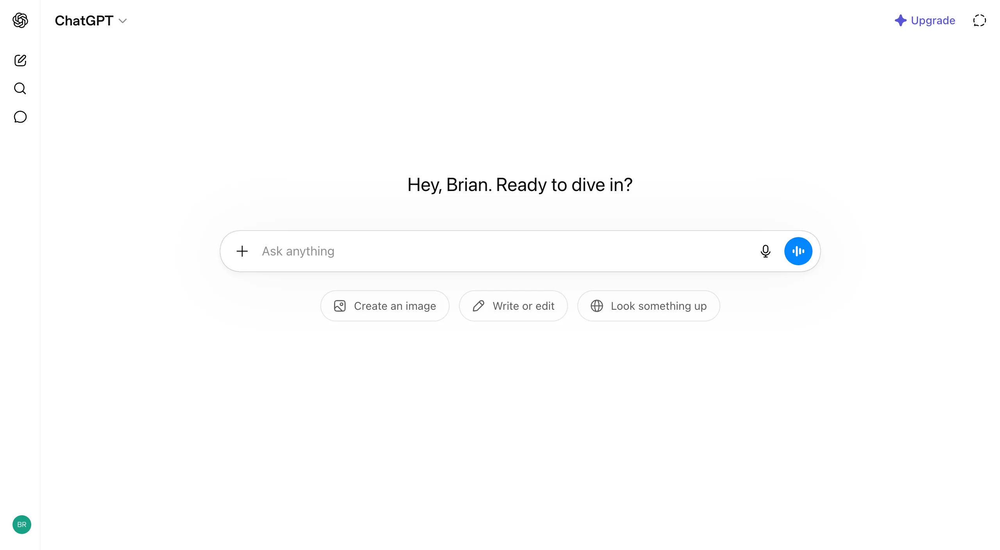
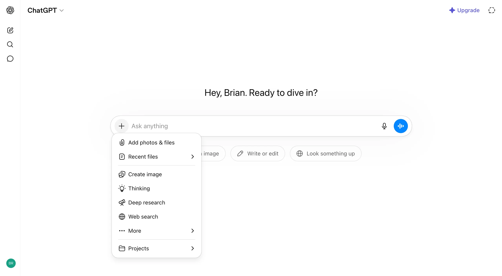

# Tool Switching in Composer

**Category:** [Inputs](https://aiuxplayground.com/patterns/input)  
**Interactive demo:** [https://aiuxplayground.com/pattern/tool-switching](https://aiuxplayground.com/pattern/tool-switching)

> Switch between AI capabilities within composer

## What it is

Tool switching is an AI UX pattern that lets users activate, deactivate, or change capabilities (search, code, image, connectors) from the composer before send. Chips, menus, or mode controls make the active tool set visible so users know what the model can do on this turn.

## When to use

Essential for multi-capability AI assistants, developer tools, and creative platforms where users need to explicitly select which AI tools to use for their queries.

## When not to use

- Single-capability products where a tool picker is empty ceremony.
- Agent flows that must choose tools automatically and only need post-hoc disclosure.
- Mobile composers where more than one primary mode chip crowds the send control.

## Anti-patterns

- Hidden tools with no discoverable entry until after the user fails.
- Active tools with no removable chip or clear off state.
- Parallel discovery paths (slash, +, mode chips) with no shared mental model.
- Mode labels that change cost or latency without saying so.

## How products use it

| Product | Implementation |
|---------|----------------|
| ChatGPT | One + menu for attach, tools, and modes; removable chips show scope before send. |
| Claude | Web search default on; + menu for skills and attach; model/effort on the bar. |
| Perplexity | Primary mode chips (Search, Computer); + for uploads and connectors. |
| Gemini | + menu leads with Drive; Deep research and creation tools in flyouts. |

## Examples

*Tool Switching in Composer*

*Tool Switching in Composer*

## Try it live

Interactive demo, screenshots, and full guidance on the site:

**[Open Tool Switching in Composer on AI UX Playground →](https://aiuxplayground.com/pattern/tool-switching)**

Or browse all [Inputs patterns](https://aiuxplayground.com/patterns/input).
