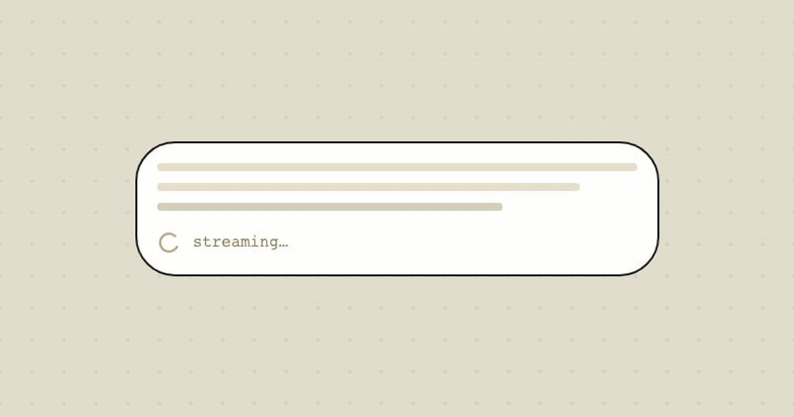

# Streaming

**Category:** [Outputs](https://aiuxplayground.com/patterns/output)  
**Interactive demo:** [https://aiuxplayground.com/pattern/streaming](https://aiuxplayground.com/pattern/streaming)

> Show replies token-by-token as they generate

## What it is

Streaming is a critical AI interface design pattern that displays AI-generated content token-by-token as it is being produced, rather than waiting for the complete response. This UX pattern dramatically reduces perceived latency by giving users immediate feedback that the AI is working, even for long-form responses that take several seconds to generate. By showing text appear progressively, streaming creates a sense of responsiveness and engagement, making wait times feel shorter and keeping users focused on the conversation. The pattern is essential for modern AI chat interfaces where response times can vary significantly, and user experience depends heavily on perceived performance rather than actual latency.

## When to use

Essential for all AI chat interfaces, text generation tools, and conversational AI applications where response time perception directly impacts user satisfaction.

## Seen in

- ChatGPT
- Claude
- Google Bard
- Perplexity

## Examples

*AI UX Playground*

## Try it live

Interactive demo, screenshots, and full guidance on the site:

**[Open Streaming on AI UX Playground →](https://aiuxplayground.com/pattern/streaming)**

Or browse all [Outputs patterns](https://aiuxplayground.com/patterns/output).
