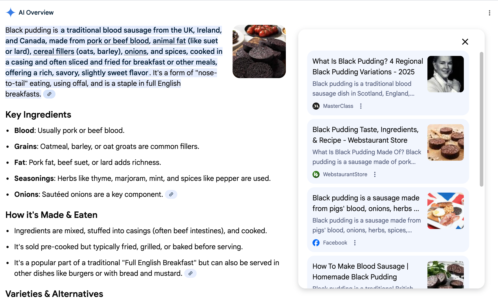
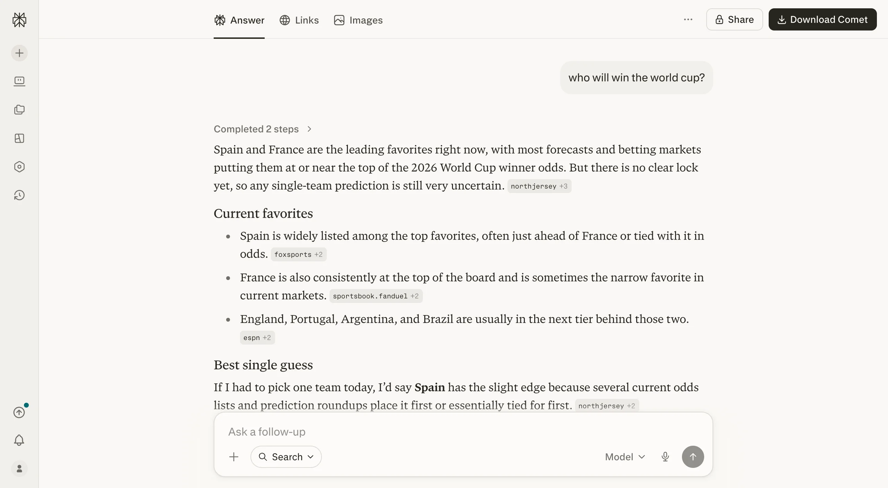

# Citations

**Category:** [Trust](https://aiuxplayground.com/patterns/trust)  
**Demo:** [aiuxplayground.com/pattern/citations](https://aiuxplayground.com/pattern/citations)

> Attach verifiable sources to generated claims

## Overview

Citations is an AI interface design pattern that displays source references as footnotes, links, or inline markers in AI-generated content, allowing users to verify claims and explore original sources. This UX pattern builds trust and transparency by showing where information comes from, enabling users to verify accuracy and dive deeper into source material. Citations typically appear as numbered markers or links that users can click to view the source document, website, or reference. This pattern is essential for research tools, search engines, and knowledge applications where source credibility directly impacts user trust. It transforms AI from a black box into a transparent, verifiable information system.

## Good for

Essential for research tools, AI search engines, and knowledge applications where source citations build trust and enable verification of AI claims.

## Seen in

- Perplexity
- Google Search
- Bing Chat
- Elicit

## Screenshots

## On the site

[Citations demo](https://aiuxplayground.com/pattern/citations) · [more trust](https://aiuxplayground.com/patterns/trust)
